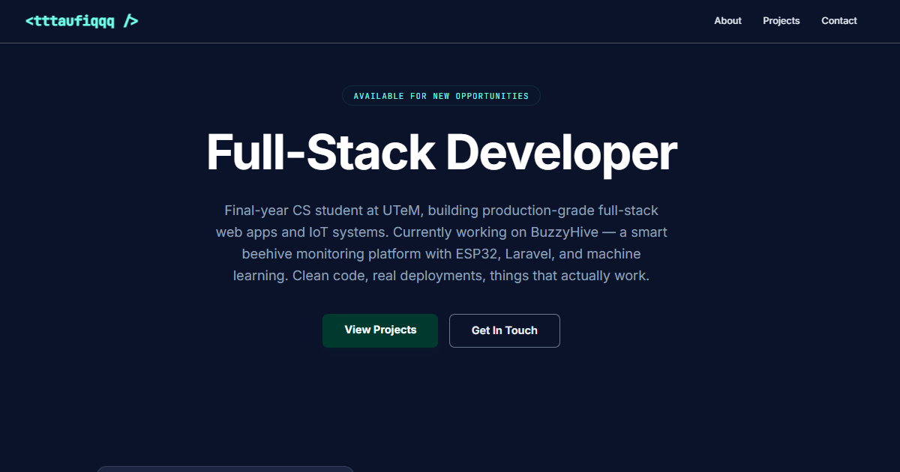

# tttaufiqq — Developer Portfolio

A full-stack developer portfolio with a built-in CMS. Manage projects, skills, experiences, and page content entirely from the admin panel — no redeploys needed for content updates.

**Live →** https://tttaufiqq-portfolio-ahhgd6gfg8dzdddc.southeastasia-01.azurewebsites.net



---

## Stack

| Layer | Technology |
|---|---|
| Frontend | React 19 + Vite, TypeScript, React Router v7 |
| Styling | Tailwind CSS v4, Framer Motion |
| Backend | Express.js + TypeScript + Prisma ORM |
| Database | Azure SQL (Basic tier, Southeast Asia) |
| Storage | Azure Blob Storage (images, resume, avatar) |
| Auth | JWT in httpOnly cookie, bcrypt, helmet.js, rate limiting |
| Notifications | Telegram bot + Resend email (on new contact message) |
| CI/CD | GitHub Actions → Azure App Service (B1) |
| Testing | Vitest + Testing Library — 81 tests (56 backend, 25 frontend) |

---

## Features

### Public Site
- **Home** — hero, featured projects, skills grid, experience timeline (all API-driven)
- **Projects** — full listing with tech stack tags and status filter
- **Project Detail** — rich content pages built from blocks (heading, text, image, video, code)
- **Contact** — rate-limited form (5/hr), email validation, stored in database

### Admin Panel (`/admin`)
- **Projects** — create, edit, delete, drag-to-reorder, status/featured control
- **Block Editor** — compose project pages block by block, drag-to-reorder
- **Skills** — CRUD, drag-to-reorder, brand icon picker (60+ logos) + emoji support
- **Experience** — CRUD, drag-to-reorder, date range + current role toggle
- **Messages** — view contact submissions, expandable preview, delete; Telegram + email alert on new message
- **Profile** — singleton profile: name, role, bio, avatar, resume, social links; all rendered live on public site

---

## Local Development

### Prerequisites
- Node.js 22+
- SQL Server (local: `MSI\SQLEXPRESS`) or Azure SQL connection string

### Setup

**1. Install dependencies**
```bash
npm install
cd server && npm install
```

**2. Configure environment**

Create `server/.env`:
```env
DATABASE_URL="sqlserver://localhost;database=portfolio;integratedSecurity=true;trustServerCertificate=true"
JWT_SECRET="your-jwt-secret"
ADMIN_PASSWORD_HASH="bcrypt-hash-here"
CLIENT_ORIGIN="http://localhost:3000"
AZURE_STORAGE_CONNECTION_STRING="your-blob-connection-string"
AZURE_STORAGE_CONTAINER_NAME="portfolio-media"
RESEND_API_KEY="re_..."
TELEGRAM_BOT_TOKEN="your-bot-token"
TELEGRAM_CHAT_ID="your-chat-id"
```

Generate a password hash:
```bash
cd server && npx ts-node scripts/generate-hash.ts yourpassword
```

**3. Push database schema**
```bash
cd server && npm run db:push
```

**4. Run both servers**

```bash
# Terminal 1 — backend (port 8080)
cd server && npm run dev

# Terminal 2 — frontend (port 3000, proxies /api → 8080)
npm run dev
```

Admin: http://localhost:3000/admin/login

> `@/` alias maps to the **project root**, not `src/`.

---

## Project Structure

```
portfolio/
├── pages/
│   ├── public/          — Home, Projects, ProjectDetail, Contact
│   └── admin/           — Login, ProjectsTab, SkillsTab, ExperiencesTab, MessagesTab, ProfileTab
├── layouts/             — PublicLayout (navbar+footer), AdminLayout (tabs+auth guard)
├── components/
│   ├── public/          — ProjectCard, SkillBadge, TimelineItem, block renderers
│   └── admin/           — Form modals, IconPicker, SortableRow, shared UI primitives
├── lib/                 — utils.ts, tokens.ts, icon-map.ts
├── types/               — models.ts (Project, Skill, Experience, Message, Profile, ContentBlock)
├── src/                 — Vite entry only (main.tsx, index.css)
└── server/
    ├── routes/          — auth, projects, skills, experiences, messages, blocks, upload, profile
    ├── middleware/       — requireAuth, rateLimiter
    ├── prisma/          — schema.prisma
    └── scripts/         — generate-hash.ts
```

---

## Testing

```bash
# Frontend (25 tests)
npm test

# Backend (56 tests)
cd server && npm test

# With coverage
npm run test:coverage
cd server && npm run test:coverage
```

---

## Commands

```bash
# Frontend
npm run dev            # Dev server (port 3000)
npm run build          # Production build
npm run lint           # TypeScript check

# Backend (from server/)
npm run dev            # Dev server with hot reload (port 8080)
npm run build          # Compile TypeScript
npm run db:push        # Sync Prisma schema to database
npm run db:studio      # Open Prisma Studio (database GUI)
```

---

## Deployment

Push to `main` triggers the GitHub Actions pipeline:
1. Run all tests (frontend + backend) — deploy blocked on failure
2. Build frontend (`vite build`)
3. Build server (`tsc` + `prisma generate` for Linux binary)
4. Push schema to Azure SQL (`prisma db push`)
5. Zip and deploy to Azure App Service

**Required GitHub Secrets:**

| Secret | Description |
|---|---|
| `DATABASE_URL` | Azure SQL connection string |
| `PUBLISH_PROFILE` | Azure App Service publish profile (XML from Azure Portal) |

All other env vars (`JWT_SECRET`, `ADMIN_PASSWORD_HASH`, `AZURE_STORAGE_*`, `RESEND_API_KEY`, `TELEGRAM_*`) are set in Azure → App Service → Environment Variables.

---

## API Routes

| Method | Route | Auth | Description |
|---|---|---|---|
| POST | `/api/auth/login` | — | Login (rate limited) |
| POST | `/api/auth/logout` | — | Clear session cookie |
| GET | `/api/auth/check` | — | Check auth status |
| GET | `/api/profile` | — | Get profile (auto-creates default) |
| PUT | `/api/profile` | JWT | Update profile |
| DELETE | `/api/profile/avatar` | JWT | Remove avatar + blob cleanup |
| DELETE | `/api/profile/resume` | JWT | Remove resume + blob cleanup |
| POST | `/api/upload` | JWT | Upload file → Azure Blob Storage |
| GET | `/api/projects` | — | List projects (filter by status/featured) |
| GET | `/api/projects/:slug` | — | Get project + prev/next nav |
| POST | `/api/projects` | JWT | Create project |
| PUT | `/api/projects/:id` | JWT | Update project |
| DELETE | `/api/projects/:id` | JWT | Delete project |
| PATCH | `/api/projects/reorder` | JWT | Bulk reorder |
| GET | `/api/projects/:id/blocks` | — | List blocks |
| POST | `/api/projects/:id/blocks` | JWT | Create block |
| PATCH | `/api/projects/:id/blocks/reorder` | JWT | Reorder blocks |
| PUT | `/api/blocks/:id` | JWT | Update block |
| DELETE | `/api/blocks/:id` | JWT | Delete block |
| GET | `/api/skills` | — | List all skills |
| POST/PUT/DELETE | `/api/skills` | JWT | CRUD |
| PATCH | `/api/skills/reorder` | JWT | Reorder |
| GET | `/api/experiences` | — | List all experiences |
| POST/PUT/DELETE | `/api/experiences` | JWT | CRUD |
| PATCH | `/api/experiences/reorder` | JWT | Reorder |
| POST | `/api/messages` | — | Submit contact form |
| GET | `/api/messages` | JWT | List all messages |
| DELETE | `/api/messages/:id` | JWT | Delete message |
